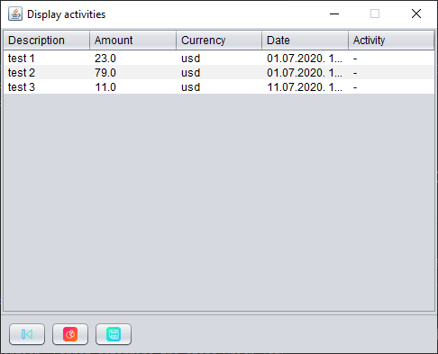

# personal-accounting

### Introduction

Compact and standalone desktop Java app combined with 
SQLite database for keeping track of your finances.

### Getting Started
This section will be dedicated to explaining 
application's features and how to use them.

#### Initial setup

If you haven't set up the app, or it is your first time
starting it, you will be met with the following
screen

Click on the next button, which will lead you to the configurations page

Here, you enter currencies whose balances you wish to keep track of. Bear in mind, currency abbreviations
must be exactly 3 characters long. In addition, you have to enter at least one before proceeding.

If you entered everything correctly, click the add button:  

After that, you can add more currencies, or you can finish the setup by clicking the next button: 

Now, after the setup is complete, you are free to use the app however you want.

#### Panels

In this section, all app's and panels and functionalities will be explained.

##### Home Panel

After setup and every time after that, once you start the app you will be greeted with a home screen

Here you can see the current balance of each of your currencies. Currently displayed currency can be changed by
selecting a desired one through a menu

###### Home Panel Legend
Home panel buttons will be explained. Other panels mentioned here will be explained shortly.

* add activity button  takes you to add activity panel
* activities history button  takes you to activities filter panel
* balances history button  takes you to balances filter panel
* add currency button  takes you to add currency panel
* settings button  takes you to settings panel
* help button  will display help message which will take you to my github page

If at any time you forget which button is which, tooltips are provided for each button.

##### Add Activity Panel

If you click on the add activity button, you will be presented with the AddActivityPanel. 

Here you can choose which currency and type your activity has. After you've entered everything, you can confirm
by clicking the ok button . You can go back to home panel by clicking 
the back button 

##### Add Currency Panel

If you forgot to add a currency during the initial setup, it is no problem. You can always add additional currencies
by clicking on the home panel's add currency button

#### Activities History Panel

Here you can search and filter all of your past activities

After clicking ok button, if there are no results or parameters were not specified correctly, warning or
error message will be displayed. Otherwise, you will be presented with a Display Activities Panel.

#### Display Activities Panel

Here all filtered activities are displayed and can be sorted at will.

By clicking the chart button , you can view the activities in the form of a pie chart.
Be aware, graph can be displayed only if one currency is selected and one kind of activity.

By clicking the save button , you can export the table as pdf to a desired location.

Plus represents income and minus represent expense.

#### Balances History Panel

The same way you can filter activities, you can filter balances.

After clicking ok button, if there are no results or parameters were not specified correctly, warning or
error message will be displayed. Otherwise, you will be presented with a Display Balances Panel.

#### Display Balances Panel

Here all filtered balances are displayed and can be sorted at will.

By clicking the graph button , balances history will be displayed in the form of a graph.
Be aware, graph can be displayed if only one currency is selected.

By clicking the save button , you can export the table as pdf to a desired location.

#### Settings Panel

Here you can tweak the app to your liking:
* you can change the LookAndFeel (style)
* you can change the language

Currently available languages:
* serbian latin
* english

Currently available styles:
* nimbus
* metal
* mcwin
* system default - it will look different on different platforms

Language changes are real time and are saved for the next startup.

### Installers

If you do not wish to download the entire repository, installers are available in the releases section.
### Additional information

* App will save data about your last used LookAndFeel, language and last position of the window and 
when run next time it will apply those settings
* App was written using jdk-14.0.1 and jdk-12.0.2 and can be run by them.

### Known bugs and issues

* Properties files containing UTF characters cannot be properly loaded when program is executed from a
executable .jar file.

* Loading last saved look and feel sometimes produces NullPointerException. Cannot determine the steps which lead to the bug.

### Documentation 

Documentation is available at:
https://dimitrijekaranfilovic.github.io/personal-accounting/

### Credits
* https://iconscout.com/icon/accept-149

* https://iconscout.com/icon/balance-200

* https://iconscout.com/icon/currency-2493209

* https://iconscout.com/icon/help-question-mark-faq-support-ui-interface-6

* https://iconscout.com/icon/play-next-forward-replay-7

* https://iconscout.com/icon/plus-add-inset-append-attach

* https://iconscout.com/icon/printer-print-copy-ui-interface-paper-ink-7

* https://iconscout.com/icon/settings-382

* https://iconscout.com/icon/skip-back-6

* https://iconscout.com/icon/stock-market-analysis-2031586

* https://iconscout.com/icon/save-saveas-tool-inkscape-storage-store-9

* https://iconscout.com/icon/piechart-82

* https://iconscout.com/icon/graph-1567975

